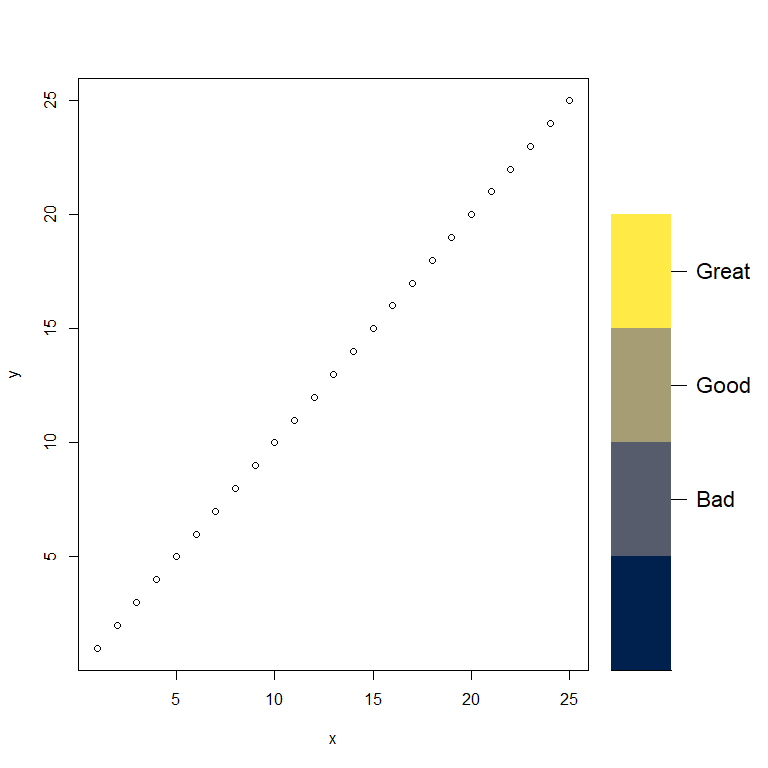
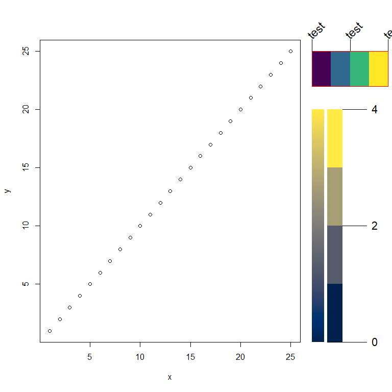

Readme
================
Christopher Dory
2025-12-16

# Introduction

I wrote this color bar function because I was tired of the horrible ones
that the terra and raster libraries generated.

# Variable documentation

<b><font size = "3">colors</font></b>: *vector*, series of colors to
appear on the color bar. <br/> <br/>
<b><font size = "3">xleft</font></b>: *numeric*, default to
*par(‘usr’)\[1\]*. The left hand coordinate of the color bar.
Coordinates are in plot values and not paper values (0,1).  
<br/> <b><font size = "3">ybot</font></b>: *numeric*, default to
*par(‘usr’)\[3\]*. The bottom coordinate of the color bar. Coordinates
are in plot values and not paper values (0,1). <br/> <br/>
<b><font size = "3">xright</font></b>: *numeric*, *default to
par(‘usr’)\[1\]**0.2*. The right hand coordinate of the color bar.
Coordinates are in plot values and not paper values (0,1). <br/> <br/>
<b><font size = "3">ytop</font></b>: *numeric*, default to
*par(‘usr’)\[4\]**0.8*. The top coordinate of the color bar. Coordinates
are in plot values and not paper values (0,1). <br/> <br/>
<b><font size = "3">labels_TF</font></b>: *boolean*, default *FALSE*.
Whether labels are to be assigned to the color bar. <br/> <br/>
<b><font size = "3">line_length</font></b>: *numeric*, default
*(par(‘usr’)\[4\] - par(‘usr’)\[3\]) * *0.1*. How long the lines for
labels connecting the color bar to the label are to be drawn. Value a
plot and not paper (0,1) value. <br/> <br/>
<b><font size = "3">labels_at</font></b>: *numeric vector*, default
*NULL*. Which colors labels are to be drawn at. For example if there are
10 colors and you wanted a label at the bottom, middle, and top this
argument would be c(1,5,10). <br/> <br/>
<b><font size = "3">labels_text</font></b>: *char vector*, default
*NULL*. The labels to be placed at *labels_at*. Must be the same length
as *labels_at*. <br/> <br/> <b><font size = "3">xpd</font></b>:
*boolean*, default *TRUE*. Whether the color bar can exceed the
coordinates of the plot region. <br/> <br/>
<b><font size = "3">middle</font></b>: *boolean*, default *FALSE*.
Whether labels appear in the middle of their color (for categorical
variables). *FALSE* means they appear at the bottom of the value (unless
the final value). <br/>

# Function Usage Examples

<br/>

<font size = "3">This shows how to place labels at the middle of colors
for categorical variables. Notice the number of labels do not have to
equal the number of colors. For this both a *label_at* value of 0 and 1
will place a label in the first color.</font> <br/> <br/>

``` r
#-------------------------------------------------------------------------------
# set up two plot regions
nf <- layout(matrix(c(1,2), nrow = 1),
             widths = c(1,0.3))
#-------------------------------------------------------------------------------

#-------------------------------------------------------------------------------
# main data plot
# adjust margins so it hugs the next plot to the right tightly
par(mar = c(5.1,4.1,4.1,0.1))
plot(c(1:25), xlab = 'x', ylab = 'y')
#-------------------------------------------------------------------------------

#-------------------------------------------------------------------------------
# second plot region that is hidden by removing all its axes and data
par(mar = c(5.1,1.1,4.1,0.1))
plot(c(1:25),
     xaxt = 'n',
     yaxt = 'n',
     col  = 'white',
     xlab = '',
     ylab = '')
box(col = 'white')
#-------------------------------------------------------------------------------

#-------------------------------------------------------------------------------
n_colors <- 4
Custom_Color_Bar(colors      = viridis::cividis(n = n_colors),
                 xleft       = 0,
                 ybot        = 0,
                 xright      = 10,
                 ytop        = 20,
                 labels_TF   = TRUE,
                 middle      = TRUE, # place at middle
                 labels_at   = c(2,3,4),
                 labels_text = c('Bad','Good','Great')) # use any arbitrary text
```

<!-- -->

<font size = "3">This shows how to place labels at the middle of colors
for categorical variables. These values are based on matrix indexing.
Therefore, if you set a label to be at a non integer value the first
digit will be what is represented. For example a value of between 2-2.99
will cause that label to appear at the second color division. Because
this, along with the categorical example above is just done with the
rect() function you can place as many color bars as you want. <br/>
<br/>

``` r
#-------------------------------------------------------------------------------
# set up two plot regions
nf <- layout(matrix(c(1,2), nrow = 1),
             widths = c(1,0.3))
#-------------------------------------------------------------------------------

#-------------------------------------------------------------------------------
# main data plot
# adjust margins so it hugs the next plot to the right tightly
par(mar = c(5.1,4.1,4.1,0.1))
plot(c(1:25), xlab = 'x', ylab = 'y')
#-------------------------------------------------------------------------------

#-------------------------------------------------------------------------------
# second plot region that is hidden by removing all its axes and data
# adjust the margins so that it hugs the first plot tightly
par(mar = c(5.1,1.1,4.1,0.1))
plot(c(1:25),
     xaxt = 'n',
     yaxt = 'n',
     col  = 'white',
     xlab = '',
     ylab = '')
box(col = 'white')
#-------------------------------------------------------------------------------


#-------------------------------------------------------------------------------
n_colors <- 4
Custom_Color_Bar(colors      = viridis::cividis(n = 1000),
                 xleft       = 0,
                 ybot        = 0,
                 xright      = 4,
                 ytop        = 20,
                 labels_TF   = FALSE)

Custom_Color_Bar(colors      = viridis::cividis(n = n_colors),
                 xleft       = 5,
                 ybot        = 0,
                 xright      = 10,
                 ytop        = 20,
                 labels_TF   = TRUE,
                 middle      = FALSE, # do not place at middle
                 line_length = 8, # adjust line length to demonstrate
                 labels_at   = c(0,n_colors/2,n_colors),
                 labels_text = c(0,
                                 2,4))
```

<!-- -->
